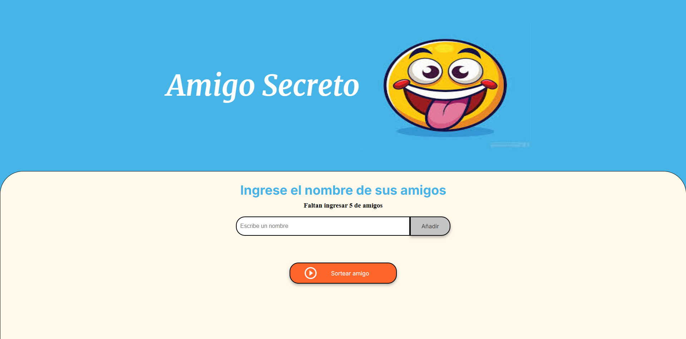
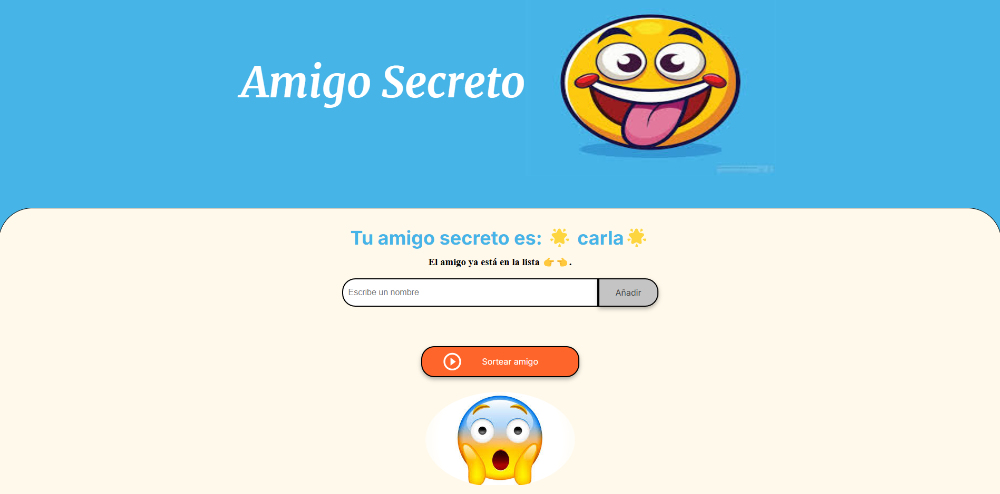

# Amigo Secreto 🎁

Este proyecto es una aplicación web sencilla para realizar un sorteo de "Amigo Secreto" de manera fácil y divertida. Permite agregar nombres de participantes y luego seleccionar aleatoriamente a un amigo secreto.

## 🚀 Características

**Permite ingresar hasta 5 nombres únicos.**

**Valida que solo se ingresen letras y espacios (sin números ni caracteres especiales).**

**No permite nombres duplicados.**

**Realiza el sorteo aleatorio entre los participantes.**

**Muestra una imagen de felicitaciones al sortear.**

## 🛠 Tecnologías utilizadas

<ins>HTML5</ins>: Estructura de la aplicación.

<ins>CSS3</ins>: Diseño y estilos visuales.

<ins>JavaScript (ES6+)</ins>: Lógica del sorteo y validaciones.

## 📌 Instalación y ejecución

1. Clona este repositorio:

* git clone https://js-alvarez.github.io/Amigo-Secreto/

2. Abre el archivo index.html en tu navegador preferido.

## 📝 Instrucciones de uso:

* Ingresa los nombres de los participantes (máximo 5).

* Presiona el botón "Añadir" después de escribir cada nombre.

* Una vez completada la lista, presiona el botón "Sortear amigo".

* Se mostrará el nombre del amigo secreto sorteado junto con una imagen de felicitaciones.

## Notas

* No se pueden ingresar más de 5 nombres -> Esto es una restricción intencional para evitar errores.

* Se ingresan números o caracteres especiales -> El sistema mostrará un mensaje de error.

* La imagen de felicitaciones aparece todo el tiempo -> Se ha corregido para que solo aparezca al sortear.

